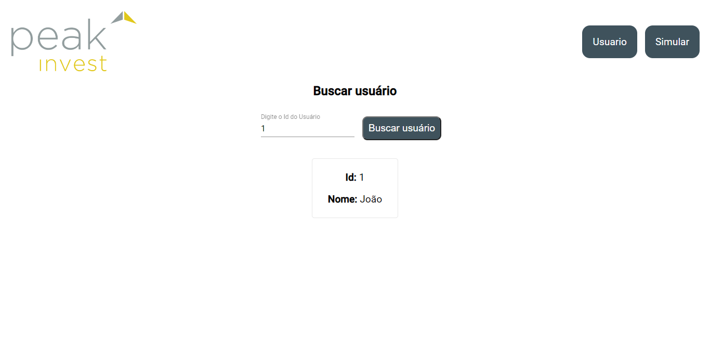
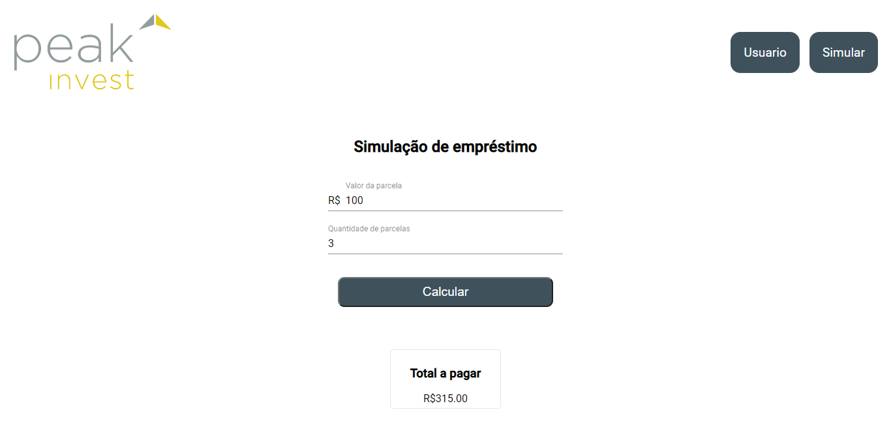
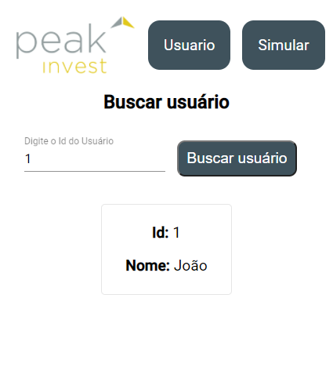
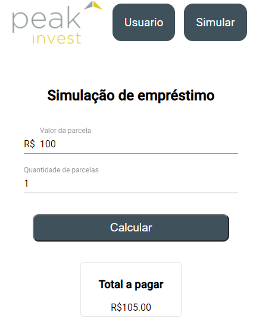

# Peak Invest Front

## Iniciando aplicação
- Use o comando `npm install` para instalar as dependências
- Após a instalação use o comando `ng serve --open` para inicializar a aplicação

## Imagens

Desktop

  <pre>
    
    
  </pre>

Mobile

  <pre>
    
    
  </pre>

 

Desenvolvido por: [Vitor](https://www.linkedin.com/in/vitorrodrig/)

Projeto gerado no [Angular CLI](https://github.com/angular/angular-cli) version 12.0.2.